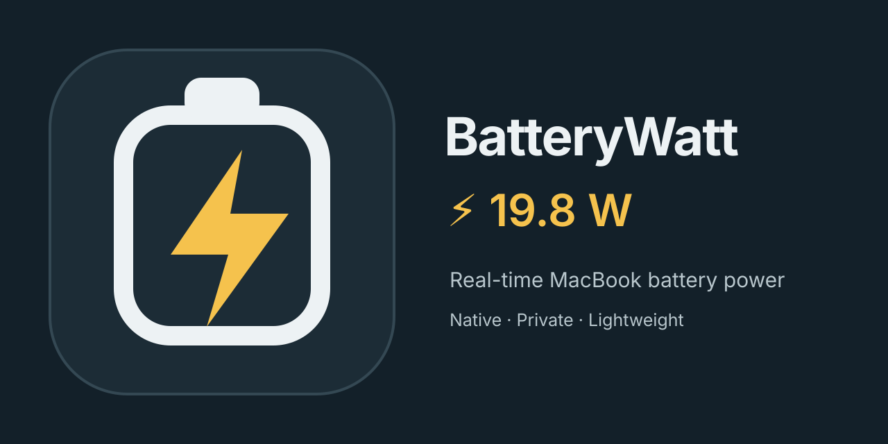

# BatteryWatt

See how much power is flowing into or out of your MacBook battery - live in the menu bar.

<p align="center">
  
</p>

BatteryWatt is a small native macOS utility for seeing battery-side power at a glance. It supports charging and discharging readings, stays out of the way when there is no useful reading, and keeps everything on the Mac.

> **Media note:** the repository only publishes screenshots and recordings captured from the installed app. A live wattage capture requires a MacBook in an active power state; it is not replaced with a mockup.

## Why BatteryWatt?

The macOS battery percentage tells you how full the battery is. BatteryWatt shows what the battery is doing right now:

- Real-time charging and discharging watts
- Configurable visibility: Charging only, Always, On battery only, or Adapter connected
- Native menu bar status item with semantic light/dark rendering
- Optional local history, session statistics, approximate energy, and CSV export
- Launch at Login and a compact native Settings window
- No analytics, no accounts, no network required

BatteryWatt is deliberately focused on battery power. It is not a CPU, GPU, RAM, disk, fan, or network monitor, and it is designed to sit comfortably beside utilities like Stats without pretending to integrate with them.

## Installation

### Homebrew

```sh
brew tap nkhaduy/batterywatt && brew install --cask batterywatt
```

### DMG

Download `BatteryWatt-1.0.0.dmg` from the [GitHub Releases](https://github.com/nkhaduy/BatteryWatt/releases) page, open it, and drag BatteryWatt to Applications. The release also includes a SHA-256 checksum file.

The initial public build is ad-hoc signed and not notarized because a Developer ID identity is not available in the build environment. macOS may require opening it from Finder with Control-click -> Open the first time. Future signed releases will remove that step.

To uninstall, quit BatteryWatt and remove `BatteryWatt.app` from Applications. Launch at Login is disabled automatically when the app is removed; preferences and optional history can be removed separately from `~/Library/Application Support/BatteryWatt`.

### Optional npm helper

BatteryWatt is a native app, not an npm application. The repository includes a dependency-free npm helper for developers who prefer a CLI installer. It downloads only official GitHub Release assets, verifies `SHA256SUMS.txt`, and requires an explicit command:

```sh
npx batterywatt install
```

There is no `postinstall` script and `npm install` never installs or launches the app. The helper is intentionally secondary to Homebrew and the official DMG.

## How it works

BatteryWatt reads AppleSmartBattery telemetry through IOKit and calculates battery-side power as:

```text
watts = Voltage(mV) * abs(InstantAmperage(mA)) / 1,000,000
```

For example, `11,754 mV * 4,775 mA / 1,000,000 = 56.12535 W`, displayed as `56.1 W` with the default formatting.

Charging power is power flowing into the battery. Discharging power is approximate instantaneous output from the battery. Neither number is necessarily the total power drawn from the USB-C wall adapter or the total consumption of every Mac component.

For example, a 65 W adapter can supply the Mac, the display, and the battery at the same time. BatteryWatt may show about 56 W because that is the portion measured entering the battery.

## Settings

BatteryWatt defaults to **Charging only** so existing users do not suddenly get a new always-visible status item after an update.

- **Menu Bar Visibility:** Charging only, Always, On battery only, Adapter connected
- **Refresh Interval:** 1, 2, 5, or 10 seconds
- **Direction Style:** Bolt only, Direction, or Signed
- **Icon:** Bolt, Direction, or None
- **Decimals:** 0, 1, or 2, with optional space before `W`
- **Behavior:** hide when full and hide readings below a configurable threshold
- **History:** opt-in local SQLite history with bounded retention

History is disabled by default. When enabled, BatteryWatt stores samples locally, batches writes, compacts older readings, tracks charging/discharging sessions, and offers a native graph and CSV export. Energy values are estimates based on integrating observed samples; sleep, wake, clock changes, and missing readings are not treated as continuous power.

## Privacy

BatteryWatt is 100% local:

- No analytics
- No tracking
- No accounts
- No telemetry upload
- No cloud sync
- No server dependency for normal operation

See [PRIVACY.md](PRIVACY.md) for the short privacy statement.

## Requirements and limitations

- macOS 13 Ventura or newer
- Apple Silicon is the primary supported architecture
- The release contains a universal `arm64` + `x86_64` binary, but Intel telemetry has not been verified on physical Intel hardware
- Designed primarily for MacBook models with an internal battery
- Desktop Macs without an AppleSmartBattery service remain hidden and do not crash
- Readings describe battery-side power, not laboratory-grade adapter or system power

## Building from source

Xcode is not required for the command-line build used by this repository, although the macOS Command Line Tools are. From the repository root:

```sh
swift test
./scripts/check.sh
./scripts/build.sh 1.0.0
./scripts/package-dmg.sh 1.0.0
```

Artifacts are written to `build/` and `dist/`. The build produces a native `.app`, a DMG with an Applications alias, a ZIP, and `SHA256SUMS.txt`. Signing uses `CODESIGN_IDENTITY` when supplied; otherwise it creates an ad-hoc local build.

The small Foundation-only domain layer is described in [docs/ARCHITECTURE.md](docs/ARCHITECTURE.md). Release steps are documented in [docs/RELEASING.md](docs/RELEASING.md).

## FAQ

### Does `19.8 W` mean my charger draws 19.8 W?

No. It is the approximate power entering the battery at that instant. The Mac may be using additional power for the screen, processor, storage, and connected devices.

### Does it work while unplugged?

Yes. Choose **Always** or **On battery only**. Discharging power is shown as a positive magnitude by default; Direction and Signed styles can make direction explicit.

### Does it run in the Dock?

No. BatteryWatt is an accessory/menu-bar app and sets `LSUIElement` so it has no Dock icon.

### Does history leave my Mac?

No. History is local-only and opt-in. Export is a user-initiated CSV save.

### Why is the number different from a power meter at the wall?

The battery and the wall adapter are different measurement points. BatteryWatt intentionally reports the battery-side value because that is the telemetry macOS exposes consistently through AppleSmartBattery.

## Contributing

Bug reports, telemetry fixtures, documentation improvements, and focused pull requests are welcome. Please read [CONTRIBUTING.md](CONTRIBUTING.md), include sanitized diagnostics where relevant, and keep the project focused on battery power.

## License

BatteryWatt is released under the [MIT License](LICENSE).

